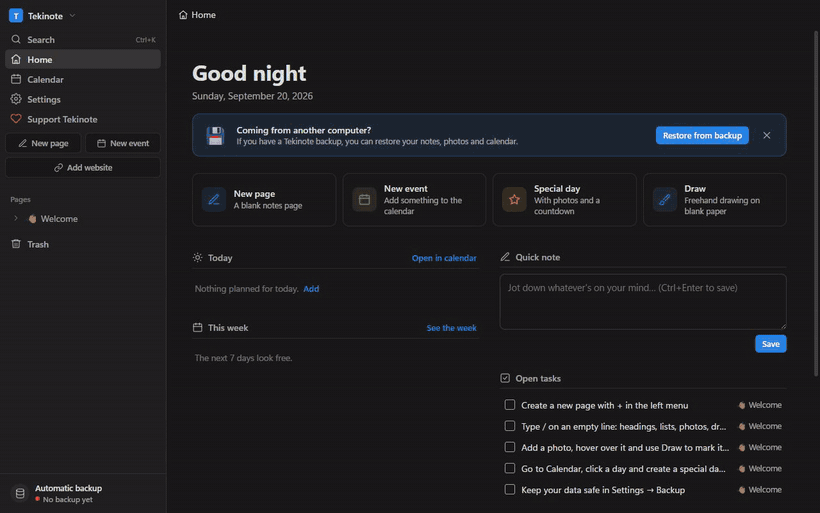
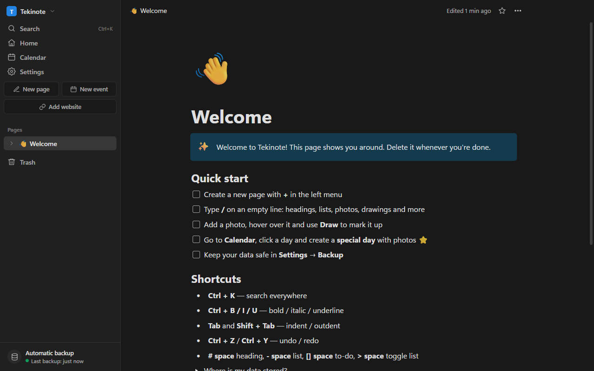
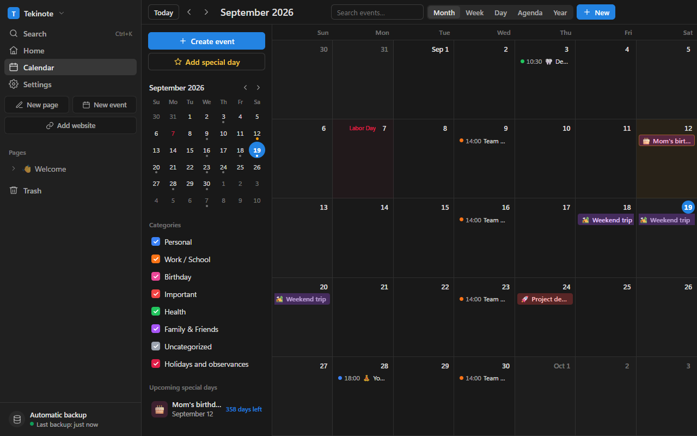

# Tekinote

**Notes, drawing on photos and a detailed calendar — in one simple Windows app.**
Your notes stay on your own computer. No account, no ads, no subscription.

*Write, draw, open websites inside your notes, lock a page with a password, and keep a calendar of special days.*

## Download

👉 **[Download the latest version](https://github.com/Tekinsv/tekinote/releases/latest)** — get `Tekinote-Setup-x.x.x.exe` and double-click it.

If Windows shows "Windows protected your PC": click **More info → Run anyway**.
(The app isn't code-signed yet, which is why Windows shows this warning.)

## Features

- **Pages & subpages** with a `/` command menu, headings, lists, to-dos, toggles, quotes, code and colors
- **Photos you can draw on** — pen, highlighter, arrows, shapes and text
- **Detailed calendar** — month / week / day / agenda / year views, recurring events, reminders, categories
- **Special days** with photos and a countdown (birthdays, anniversaries…)
- **Public holidays** for the United States and Turkey
- **Websites as pages** — open any website inside Tekinote, browse it, and draw right on top of it; your marks stay where you put them while the page scrolls
- **Password-locked pages** — text, photos and drawings are encrypted (PBKDF2 + AES-256-GCM). Without the password nobody can read them, not even on the same computer
- **Share a page** as a single file, with its subpages, photos and drawings
- **Automatic backups** to any folder — a USB drive, another disk, or your Google Drive / OneDrive folder
- **Automatic updates** — when a new version is out, a green **Update** button appears at the top right
- **English and Turkish** interface (Settings → Appearance → Language)

## Your data

Everything is stored locally on your computer and is never uploaded anywhere.
To be safe if your computer breaks: go to **Settings → Backup** and choose a USB drive or a cloud-synced folder.
On a new computer, install Tekinote and use **Restore from backup**.

## Support Tekinote

Tekinote is free and made by a single developer. If you find it useful, you can help:

- ⭐ **Star this repository** — it helps other people find Tekinote
- 🐞 **[Report a bug or suggest a feature](https://github.com/Tekinsv/tekinote/issues)**
- 💬 **Tell a friend** about Tekinote
- ❤️ **Donations** — coming soon

---

### Türkçe

Tekinote; notlar, fotoğraf üzerine çizim ve detaylı takvim içeren ücretsiz bir Windows programıdır.
[En son sürümü indir](https://github.com/Tekinsv/tekinote/releases/latest), `Tekinote-Setup-x.x.x.exe` dosyasına çift tıkla.
Windows uyarı verirse: **Ek bilgi → Yine de çalıştır**.
Program dilini **Ayarlar → Görünüm → Dil** bölümünden Türkçe yapabilirsin.
